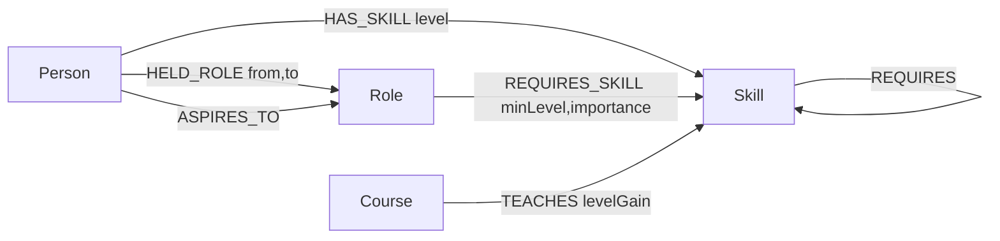

# SkillRoute — Graph-Powered Career & Skill Readiness Platform

SkillRoute answers the questions a career ladder can't: *given who I am today,
what's actually missing for the role I want, and what's the shortest path to
close that gap?* It's a graph database application built on **CognoDB**
(openCypher over Bolt) for the Wexa AI take-home assignment.

**Live demo:** _add your hosted URL here_
**Screen recording:** _add your recording link here_

---

## Why a graph database?

Careers are a graph before they're anything else:

- **Skill prerequisites are a DAG, not a table.** `Deep Learning` needs
  `Machine Learning Fundamentals`, which needs `Statistics` and
  `Linear Algebra`, which need `Probability`. Answering "what do I need to
  learn *before* the thing I need to learn?" means walking a variable-depth,
  self-referencing chain. In SQL that's a recursive CTE, run once per skill.
  In Cypher it's `(skill)-[:REQUIRES*1..5]->(prereq)` — one pattern.
- **"Shortest path to close my skill gap" is a literal graph problem.** Once
  you frame missing skills + their prerequisite chains + the courses that
  teach them as a graph, picking a short course sequence is a shortest-path
  /set-cover problem over that graph — not a series of joins.
- **"Who's a bottleneck skill?" is a centrality question.** Which skill,
  once learned (directly or as someone else's prerequisite), unlocks the
  most roles? That's an aggregation over a multi-hop traversal that starts
  from every role's requirements — awkward to express as a fixed set of
  joins because the traversal depth isn't fixed.
- **"What did people who made this exact career move actually learn?"**
  requires matching the same person across two points in their history and
  diffing two requirement sets — a natural graph pattern match, a multi-way
  self-join in SQL.

None of these are *impossible* in a relational schema — they're just the
kind of query where the join count grows with traversal depth instead of
staying fixed, and where the natural data shape (a DAG) doesn't map cleanly
onto rows and foreign keys.

---

## Data model



| Node | Key properties |
|---|---|
| `Skill` | `id`, `name`, `category` |
| `Role` | `id`, `title`, `level`, `description` |
| `Course` | `id`, `title`, `provider`, `durationHours`, `level`, `url` |
| `Person` | `id`, `name`, `currentRoleTitle` |

| Relationship | Direction | Properties |
|---|---|---|
| `(Skill)-[:REQUIRES]->(Skill)` | skill → its prerequisite | — |
| `(Role)-[:REQUIRES_SKILL]->(Skill)` | role → skill it needs | `minLevel` (1-5), `importance` (`core`/`important`/`nice-to-have`) |
| `(Course)-[:TEACHES]->(Skill)` | course → skill it teaches | `levelGain` |
| `(Person)-[:HAS_SKILL]->(Skill)` | person → skill they have | `level` (1-5) |
| `(Person)-[:HELD_ROLE]->(Role)` | person → role in their history | `from`, `to` (`YYYY-MM`) |
| `(Person)-[:ASPIRES_TO]->(Role)` | person → role they want next | — |

Seed data is a hand-curated, defensible slice of one domain (software / data
/ product careers) rather than a shallow sweep across every industry: **67
skills** (with a 75-edge prerequisite DAG up to 5 levels deep), **20 roles**,
**82 courses**, and **60 synthetic people** with generated career histories
and skills. See [`backend/seed/data/catalog.py`](backend/seed/data/catalog.py)
and [`backend/seed/data/people_generator.py`](backend/seed/data/people_generator.py).

---

## Architecture

```
skillroute/
├── backend/                 FastAPI + official neo4j Python driver
│   ├── app/
│   │   ├── main.py          App entrypoint, CORS, health check, error handling
│   │   ├── config.py        Env-var settings (no secrets hard-coded)
│   │   ├── db.py            Driver singleton + graceful "DB unreachable" handling
│   │   ├── models.py        Pydantic response schemas
│   │   ├── queries/         One module per feature; every Cypher statement lives here
│   │   └── routers/         Thin FastAPI routes calling into queries/
│   └── seed/
│       ├── data/catalog.py          Curated skills, roles, courses, prerequisites
│       ├── data/people_generator.py Deterministic synthetic people generator
│       └── seed.py                  Idempotent loader (MERGE-based)
├── frontend/                 React + TypeScript + Vite + Tailwind
│   └── src/
│       ├── api/               Typed fetch client + response types
│       ├── components/        Layout, shared UI, loading/empty/error states
│       └── pages/              Roles, Skills, Gap Report, Bottlenecks, Career Paths
├── render.yaml                Render blueprint for the backend
└── frontend/vercel.json       SPA rewrite rule for the frontend
```

**Why this split:** the backend owns every Cypher statement (parameterised,
never string-concatenated) so the frontend never talks to the database
directly. The backend is deployed as a long-running process (not serverless)
specifically so its Neo4j driver keeps one small, stable connection pool —
CognoDB's free tier caps at 200 connections, and a serverless function that
opens a fresh driver per cold start would burn through that fast.

---

## Setup

### Quick start on Windows

Once you've created your CognoDB instance (step 1 below) and filled in
`backend/.env`, just double-click **[`start.bat`](start.bat)** at the repo
root. On first run it creates the backend virtual environment, installs
both sets of dependencies, then opens the API and frontend each in their own
window and launches the app in your browser. **[`stop.bat`](stop.bat)**
shuts both down. (First time only, also run the seed script — see step 2.)

### 1. Create your CognoDB instance

1. Go to [console.cognodb.com/signup](https://console.cognodb.com/signup) and sign up (no credit card).
2. Create a free (`c0`) instance and pick a region — it provisions in under a minute.
3. From **Connect**, copy the Bolt URI (`bolt+s://<instance-id>.databases.cognodb.cloud`, or the `.com` host your console shows) and the generated password for the `cognodb` user. **The password is shown once** — copy it immediately.

### 2. Backend

```bash
cd backend
python -m venv .venv && .venv\Scripts\activate   # or `source .venv/bin/activate` on macOS/Linux
pip install -r requirements.txt
cp .env.example .env   # then fill in NEO4J_URI / NEO4J_USERNAME / NEO4J_PASSWORD
```

Load the seed data (wipes the target database first, so only point this at
a fresh/throwaway instance):

```bash
python -m seed.seed
```

Run the API:

```bash
uvicorn app.main:app --reload --port 8000
```

Check `http://localhost:8000/api/health` — it reports `{"status": "ok"}` when
CognoDB is reachable, or `"status": "degraded"` with a human-readable reason
when it isn't (the app boots either way; it never crashes just because the
database is briefly unreachable).

### 3. Frontend

```bash
cd frontend
npm install
cp .env.example .env.local   # VITE_API_BASE_URL, defaults to http://localhost:8000
npm run dev
```

Open `http://localhost:5173` (or whatever port Vite prints).

---

## The main queries, explained

All queries live in [`backend/app/queries/`](backend/app/queries/), each
file scoped to one feature and commented inline. The three worth reading
first:

1. **[`gap_analysis.py`](backend/app/queries/gap_analysis.py) — `GET_GAP_WITH_PREREQ_CHAINS`**
   The flagship query. For a target role and a known-skills list, it finds
   every required skill the person doesn't have, and for each one walks up
   to 5 levels of `REQUIRES` to pull in the *full* prerequisite chain —
   also filtered against what the person already knows — in a single
   parameterised statement. The app then runs a small greedy set-cover in
   Python to turn "skills you need" into "shortest course sequence that
   covers them."

2. **[`skills.py`](backend/app/queries/skills.py) — `GET_PREREQUISITE_CHAIN`**
   The canonical multi-hop (2+ hop) traversal: `(skill)-[:REQUIRES*1..5]->(prereq)`,
   powering the Skill Explorer's prerequisite tree.

3. **[`bottlenecks.py`](backend/app/queries/bottlenecks.py) — `GET_BOTTLENECK_SKILLS`**
   The "SQL would find this awkward" query. For every role's required
   skill, it walks that skill's own prerequisite chain (1-4 hops) and
   unions it with the skill itself, then aggregates by skill to count how
   many distinct roles each one ultimately unlocks — a variable-depth
   traversal *feeding into* an aggregation, not just a fixed join followed
   by a `GROUP BY`.

4. **[`careers.py`](backend/app/queries/careers.py) — `GET_PRECEDENT_PEOPLE_WITH_SKILLS`**
   Matches the same person across two `HELD_ROLE` edges ordered in time,
   then diffs what they know against each role's requirements to surface
   what people commonly pick up moving from role A to role B.

### A real engine bug we hit (and how we found it)

While building the career-path query, an inline Cypher pattern predicate —
`WHERE (b)-[:REQUIRES_SKILL]->(gained)`, referencing a node bound earlier in
the same query — returned `true` for *every* skill required by *any* role,
not just the bound node `b`. CognoDB is `v0.9.11` (pre-1.0), and this looks
like an engine-level bug in how it correlates pattern predicates to
previously-bound variables. We isolated it with a minimal repro (see the
commit history / interview walkthrough), then rewrote the query to compute
each role's required-skill set with a plain `MATCH ... RETURN collect(...)`
(verified correct) and did the set difference in Python instead — more
portable anyway, and it sidesteps the bug entirely.

---

## Screenshots

_Add screenshots of the Home, Gap Report (with results), Bottleneck Skills,
Skill Explorer (prerequisite chain), and Career Paths pages here before
submitting._

---

## Deployment

### Backend → Render

`render.yaml` at the repo root is a ready-to-use Render blueprint:

1. Push this repo to GitHub.
2. In Render, **New → Blueprint**, point it at the repo.
3. Fill in `NEO4J_URI`, `NEO4J_USERNAME`, `NEO4J_PASSWORD`, and `CORS_ORIGINS`
   (your deployed frontend origin) when prompted.

### Frontend → Vercel

1. Import the repo in Vercel, set the project root to `frontend/`.
2. Framework preset: Vite. Build command / output directory are auto-detected.
3. Set `VITE_API_BASE_URL` to your deployed Render backend URL.
4. `vercel.json` already handles the SPA rewrite so client-side routes
   (`/roles/:id`, etc.) don't 404 on refresh.

---

## Engineering notes

- **Secrets:** `NEO4J_URI` / `NEO4J_USERNAME` / `NEO4J_PASSWORD` are read
  from environment variables only (`backend/.env`, gitignored). Nothing
  is hard-coded or committed.
- **Error handling:** if CognoDB is unreachable, the API still boots (see
  `app/main.py`'s `lifespan`), `/api/health` reports the real status, and a
  `DatabaseUnavailableError` is translated into a clean `503` with a
  human-readable message — the frontend's `ErrorState` component surfaces
  that directly instead of a stack trace.
- **No string-concatenated Cypher anywhere** — every query in `queries/` is
  a Cypher string with named parameters, executed via the driver's
  `execute_query(cypher, parameters, ...)`.
- **Idempotent seeding:** `seed.py` uses `MERGE` keyed on each node's `id`,
  so re-running it never duplicates data; `--no-wipe` skips the initial
  `DETACH DELETE` if you want to layer onto existing data instead.

## What I'd do with more time

- Weight the shortest-course-path calculation by course difficulty/level,
  not just duration.
- A force-directed graph view of the skill DAG (currently a staircase list).
- Real auth instead of a persona picker, so a signed-in user's own profile
  drives the Gap Report.
